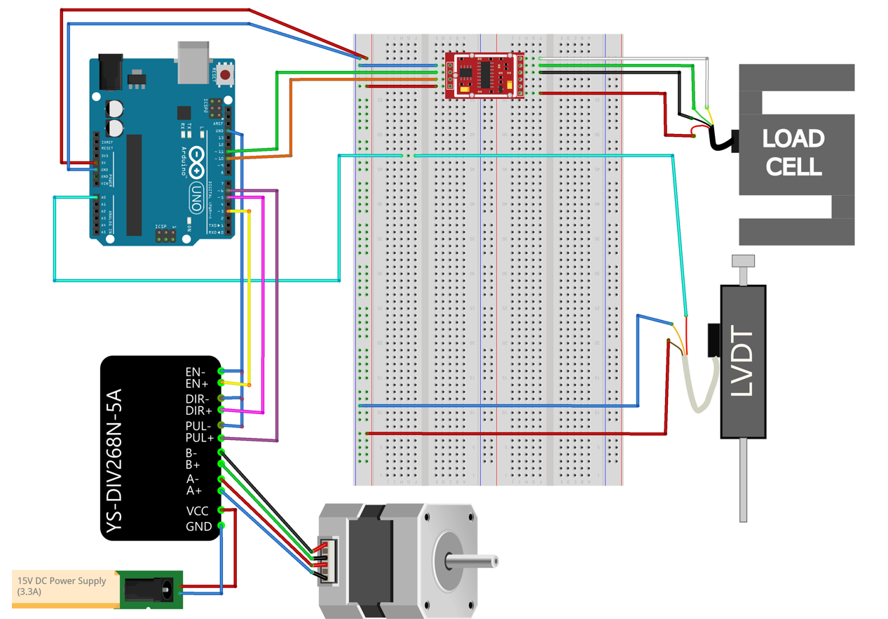
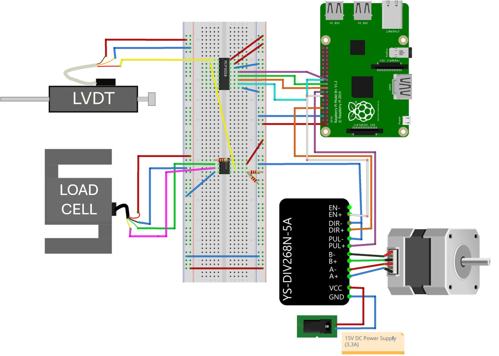

# RSSA Shear Device – Arduino Software

This Arduino sketch controls the stepper motor for the RSSA (Root-Soil Shear Assessment) device.  
It enables basic motor commands such as direction, speed, and stop/start.

---
### Wiring Diagram

The following diagram shows the electrical connections for the Arduino-based version of the device:

---
# RSSA Shear Device – Raspberry Pi Software

The Python script controls the stepper motor for the RSSA (Root-Soil Shear Assessment) device using the Raspberry Pi.
It allows the user to interact with the device through a custom graphical user interface (GUI), providing functionalities such as motor speed control, direction control, and real-time sensor data monitoring. The software also facilitates real-time plotting of LVDT and load cell readings, offering immediate feedback on the shear test.

---
## Installation

Before running the Python GUI on your Raspberry Pi, follow these steps:

Steps to Set Up MCP3008 with Adafruit Library on Raspberry Pi
i. Install Python3 and pip (if not installed already): Make sure you have Python3 installed on your Raspberry Pi.

sudo apt update
sudo apt install python3 python3-pip

ii. Install the necessary libraries: Install the Adafruit MCP3008 library and Adafruit Blinka (which provides support for Raspberry Pi GPIO).

sudo pip3 install adafruit-circuitpython-mcp3xxx
sudo pip3 install adafruit-blinka

iii. Create a virtual environment (optional but recommended): This will help keep your project dependencies isolated.

python3 -m venv mcp_env
source mcp_env/bin/activate  # To activate the environment

iv. pip install -r requirements.txt
---
## Requirements
Dependencies:

MCP3008 SPI communication: This script uses the MCP3008 Analog-to-Digital Converter (ADC) with SPI communication to interface with the sensors. The communication is facilitated using the SPI library provided by Adafruit [\cite{adafruit_mcp3008}](https://github.com/adafruit/Adafruit_CircuitPython_MCP3xxx).

For the Raspberry Pi version of the software, the following libraries are required:

- `tkinter` (for creating the GUI)
- `matplotlib` (for real-time plotting)

---
### Wiring Diagram

The following diagram shows the electrical connections for the Raspberry Pi- based version of the device:

---
### Citation
If you use this software for research purposes, please cite:

**"Rooted Soil Shear Apparatus: A low-cost, direct shear apparatus for measuring the influence of plant roots on soil shear strength"**, Sorrentino, G. et al., *HardwareX*, 2025.

---

### Author
Dr. Gianmario Sorrentino
